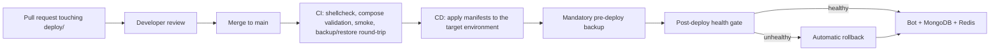

# GitOps

The Kingdoms infrastructure follows GitOps principles: the desired state of
every environment is described by versioned files in this repository, and
the deployed state converges to them through automation.

## Principles

1. **Declarative**: each environment is fully described by its compose
   manifest in `deploy/` and its documented variables.
2. **Versioned and immutable**: every environment change goes through a pull
   request; the manifests reviewed are the manifests applied.
3. **Pulled automatically**: the deploy workflows
   (`.github/workflows/deploy-<env>.yml`) apply the
   manifests after merge, executed by a self-hosted runner on the VPS
   (see [VPS-SETUP.md](VPS-SETUP.md)) — nobody applies changes by hand.
4. **Continuously reconciled**: `scripts/deploy.sh` is idempotent; re-running
   it converges the environment to the manifest state.

## Workflow

1. A change to `deploy/` or `scripts/` opens a PR; the
   `Check infra` and `CI` workflows validate it.
2. After merge to `main`, `CD` applies the new state.
3. Secrets are injected from the host `.env` (provisioned once) or GitHub
   secrets; they never live in the repository.

## Rollback

Because state is versioned, rollback is a git operation: revert the commit
(or deploy a previous tag) and let the pipeline re-apply the previous
manifest. Data-level rollback uses the database backups — every deployment
produces one *before* touching the stack, and `scripts/rollback.sh` restores
the latest one (or a given archive) as its recovery path. The CI job
`Backup/restore round-trip test` continuously verifies that a backup can be
restored byte-for-byte.
